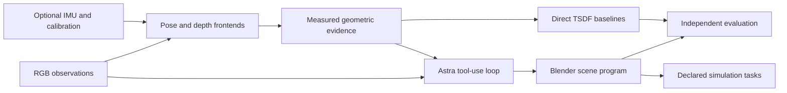

# SceneWeft code map

This describes the files actually included in the private source snapshot. Full models and large dense arrays remain external; current M4 trajectories, still images and the two presentation videos are included directly in Git. The pinned HF release predates the M4 task and LPIPS update.

| Location | Included contents |
| --- | --- |
| `src/pose/`, `integrations/openvins/` | OpenVINS pose handling, run/replay wrappers |
| `src/vipe/` | Full-video ViPE adapter, indexed depth, RGB cache and provenance |
| `src/depth/` | MapAnything pose-conditioned windows, joint batches and M4 processing |
| `src/evaluation/` | Portable pose/depth/geometry metric implementations |
| `src/tasks/` | Drone/G1 episodes, image retrieval, navigation, scene I/O and dynamics |
| `scripts/` | Packet preparation, direct fusion, rendering, metrics, task batches, blog builds and verification |
| `experiments/world_lobby/M1/legacy_source/` | Preserved historical M1 Blender builders and README |
| `experiments/world_lobby/M2, M3, M4/astra_model/` | Saved builders, revisions, measurements, semantic/collision metadata and reviews |
| `experiments/world_lobby/M3/openvins_20260923/` | Run-specific calibration/configuration and small metadata |
| `experiments/tasks/` | Frozen protocols, M4 requests/summaries/full trajectories, RGB references/candidates, endpoint images and presentation code |
| `configs/`, `data/`, `manifests/` | Modelling contract, selected-view/calibration settings, RGB/packet metadata and input inventory |
| `results/` | Selected final reports, registrations, metrics and evaluator camera metadata |
| `figures/` | Current five-by-five and baseline comparisons, trajectories, errors and M4 task panels |
| `blog/` | Bilingual article, templates, viewer source, Three.js and model-viewer bundles, task media; display GLBs externally pinned |
| `docs/`, `references/` | Original plan, metric interpretation, independent review and research sources |
| `archive/superseded_diagnostics/` | Historical diagnostic text; excluded from runnable Python |

## Entry points

- Source check: `scripts/verify_source_snapshot.py`.
- Asset download: `scripts/fetch_artifacts.py`.
- Trajectory evaluation: `scripts/evaluate_pose.py` (portable), `scripts/evaluate_current_poses.py` (historical batch).
- Fusion baselines: `scripts/fuse_baseline.py --method B1|B2|B2p`.
- Frozen scene evaluation: `scripts/evaluate_frozen_model.py`; authoritative novel depth: `scripts/evaluate_novel_depth_blender.py`.
- Current M4 tasks: `src/tasks/m4_g1/`, `scripts/m4_drone_photographic_batch.py`, `scripts/evaluate_m4_drone_photographs.py`, `scripts/m4_g1_visibility_blender.py`. Historical M3 entry points remain preserved.
- Appearance (Table 5): `scripts/evaluate_appearance_lpips.py`; report and per-view CSVs under `results/evaluation/appearance_five_views_20260925/`.
- Current evidence audit: `scripts/audit_blog_snapshot.py`; table-to-file map: `evidence/blog_20260925/README.md`.
- Final aggregation: `scripts/build_final_evaluation.py`; article build/package: `scripts/build_blog.py`, `scripts/package_blog.py`.

These historical entry points require assets/environments/path relocation as described in [REPRODUCING.md](REPRODUCING.md). Do not run them over old result directories. `results/final_evaluation.csv` lists six main systems; B2p is a supplementary matched-frontend baseline recorded separately. No `publish/` directory or deployment credentials are included.

## Data flow

M1 uses RGB alone. M2 uses ViPE. M3 uses OpenVINS and MapAnything. M4 replaces estimated pose with GT pose, without giving GT mesh/depth to the modeller. B1 shares M2's frontend; B2 uses calibrated RGB MapAnything; B2p shares M3's frontend. Evaluation GT is separate from modelling inputs except for M4's declared GT-pose condition.
