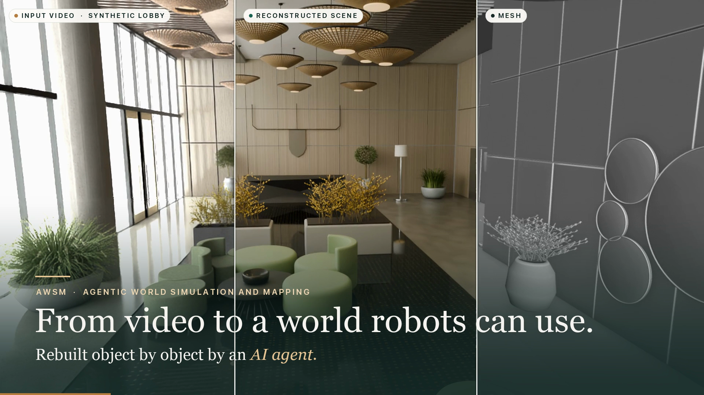

# AWSM — Agentic World Simulation and Mapping

**Geometry-grounded agentic reconstruction of editable 3D worlds.**

AWSM uses large-model agents to turn visual observations into structured Blender scenes, grounded in camera-pose and depth estimates—including IMU-informed visual–inertial constraints. The goal is to move beyond visually plausible rooms toward faithful scale, shape, and spatial relationships: an editable spatial reference for mapping, simulation, and interaction.

[中文](README.zh-CN.md) · [Research blog](https://phygital-ai.github.io/agentic-world-simulation-and-mapping/) · [Code](https://github.com/wentingw/AWSM) · [Interactive comparison](https://phygital-ai.github.io/agentic-world-simulation-and-mapping/#figure-3) · [Reproduction guide](docs/AWSM_REPRODUCTION.md)



## Updates

- **2026-10-01 · v0.1** — Released the [AWSM research blog](https://phygital-ai.github.io/agentic-world-simulation-and-mapping/) and initial reconstruction code: M1–M4 implementations, evaluation tools, and reproduction guidance.

## Approach

The reconstruction agent follows an **observe → build → verify** loop: inspect permitted observations, write Blender Python, render review views, and revise before freezing the scene for evaluation. Outputs retain explicit objects, materials, cameras, spatial relationships, and collision proxies—not just a point cloud or a rendered view.

Pose and depth constrain scene construction; they do not replace it. AWSM builds on SLAM and visual–inertial estimation, asking how geometric evidence survives the conversion into editable objects. Evaluation separates trajectory, native depth, final-scene depth, surface geometry, and appearance.

### Four reconstruction routes

The World Lobby study compares four complete pipelines in one controlled NVIDIA Isaac Sim scene, with the same 180 modelling RGB frames and a shared Astra–Blender objective.

| Method | Camera poses | Depth evidence |
| --- | --- | --- |
| **M1 · RGB-only** | No measured trajectory; common intrinsics known | None |
| **M2 · ViPE** | Estimated from RGB | Pose-conditioned Depth Anything 3 (DA3) |
| **M3 · ORB-SLAM3** | Monocular-inertial estimation from RGB + IMU + calibration | Pose-conditioned DA3 |
| **M4 · GT-pose reference** | Ground-truth camera poses | Pose-conditioned DA3 |

M4 provides reference poses, **not GT mesh or GT depth**, to the modeller. These are system comparisons, not an isolated IMU ablation; M4 is a diagnostic reference, not a deployable pose estimator.

## Results in the article

The blog's aligned M1 → M4 comparison reports:

| Metric | RGB-only M1 | GT-pose M4 | Relative reduction |
| --- | --- | --- | --- |
| Bidirectional mean surface error | 0.376 m | 0.072 m | ≈81% |
| Model-depth AbsRel · 180 evaluation views | 16.44% | 7.60% | ≈54% |

Values follow [the article's frozen Tables 2–3](https://github.com/Phygital-AI/agentic-world-simulation-and-mapping/blob/77b04cc6043b29b43b9e1ff91402343708665ada/data/tables_1_7.json); reductions use unrounded values. M1 uses GT-assisted Sim(3) alignment and M4 uses GT poses. These single-scene, system-level differences are **not native metric recovery by M1 or an IMU-only gain**. Better pose, geometry, and RGB similarity are distinct objectives; none alone establishes overall scene fidelity.

Inspect the [shared-camera 3D comparison](https://phygital-ai.github.io/agentic-world-simulation-and-mapping/#figure-3) and [matched-view images](https://phygital-ai.github.io/agentic-world-simulation-and-mapping/#figure-4) alongside the numbers. Real-capture examples in the blog are qualitative, not additional matched-GT benchmarks.

## Code and reproduction

The [September 29 experiment](experiments/world_lobby_four_trajectory_20260929/README.md) contains the reconstruction source:

- [`code/`](experiments/world_lobby_four_trajectory_20260929/code/) — trajectory preparation, DA3 inference, and geometric input packets. Native estimator solutions and upstream runtimes are external inputs.
- [`astra_blender/models/`](experiments/world_lobby_four_trajectory_20260929/astra_blender/models/) and [`astra_blender2/models/`](experiments/world_lobby_four_trajectory_20260929/astra_blender2/models/) — saved M1–M4 scene programs from two modelling runs.
- [`astra_blender2/tools/`](experiments/world_lobby_four_trajectory_20260929/astra_blender2/tools/) — input checks, model freezing, rendering, and reconstruction evaluation.

**Check the source and portable mathematics** with Python 3.10–3.12:

```bash
python -m venv .venv-core
.venv-core/bin/python -m pip install -r requirements-core.txt
.venv-core/bin/python scripts/verify_source_snapshot.py
.venv-core/bin/python scripts/check_world_lobby_depth_math.py
.venv-core/bin/python tests/test_pose_metrics.py
```

**Rebuild a saved scene** with Blender 5.2.0, choosing `M1`–`M4` and a new output directory outside the repository:

```bash
.venv-core/bin/python scripts/rebuild_world_lobby_scene.py \
  --method M4 --blender /path/to/blender \
  --output /tmp/awsm-M4-rebuild
```

This runs the later `astra_blender2` construction program, **not** fresh inference, agent reasoning, rendering, or evaluation. The article's published model set and this later ten-view run are distinct; see the [model/evidence mapping](docs/AWSM_REPRODUCTION.md#which-results-belong-to-which-models) before comparing outputs. Historical frontend naming differences remain documented in the [article provenance](https://phygital-ai.github.io/agentic-world-simulation-and-mapping/evidence/provenance-note.md).

Full-pipeline reproduction additionally requires the recorded capture, calibration, estimator solutions, weights, GT assets, authorized agent access, and path relocation. Requirements and limitations are in the [reproduction guide](docs/AWSM_REPRODUCTION.md). Future work targets efficiency, accuracy, reusable simulation assets, and persistent spatial memory; these are research directions, not results established here.

## Citation and attribution

```bibtex
@misc{awsm_2026,
  title = {{AWSM}: Agentic World Simulation and Mapping},
  author = {{Phygital AI}},
  year = {2026},
  howpublished = {Interactive research article},
  url = {https://phygital-ai.github.io/agentic-world-simulation-and-mapping/}
}
```

For reproducible comparisons, record the code revision, modelling run, model hashes, and evaluation protocol. See [THIRD_PARTY.md](THIRD_PARTY.md) for component and asset terms; this repository grants no new license.
