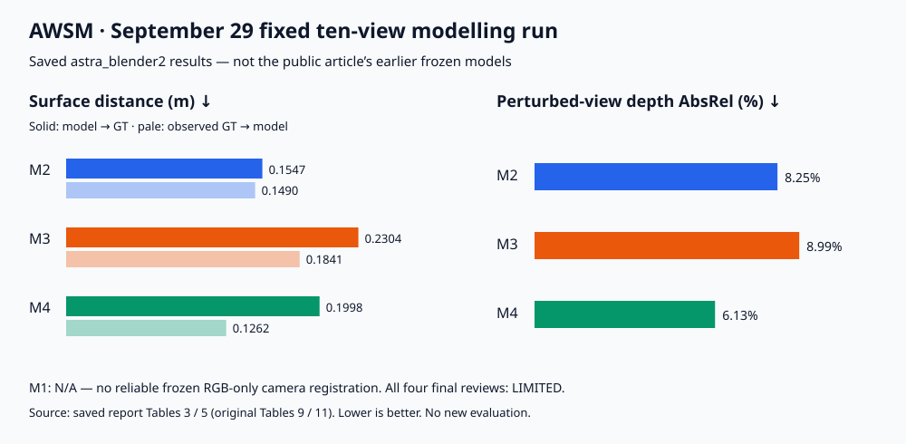

# AWSM — Agentic World Simulation and Mapping

**智能体世界仿真与建图：从视觉观测到有几何依据、可编辑的三维世界。**

AWSM 探索如何让智能体将 RGB 观测与几何测量转化为**结构化的 Blender 场景程序**：显式保留对象、材质、相机、空间关系与碰撞代理，而不止于点云或新视角渲染器。长期目标是为建图、仿真与交互提供一致的空间表示。本仓库当前发布的是**重建实现及其可追溯记录**，并非已验证的端到端机器人系统。

[English](README.md) · [官方中文文章](https://phygital-ai.github.io/agentic-world-simulation-and-mapping/zh.html) · [交互式三维对比](https://phygital-ai.github.io/agentic-world-simulation-and-mapping/zh.html#figure-3) · [详细复现指南](docs/AWSM_REPRODUCTION.md) · [实验源码](experiments/world_lobby_four_trajectory_20260929/README.md)

> **名称与证据范围。** 项目对外名称为 **AWSM**；仓库 slug、检出目录与现有代码标识仍保留 `sceneweft`。本页数值结果专指 9 月 29 日 **`astra_blender2` 固定十视角建模轮次**。在线文章展示的是另一组冻结模型（`astra_blender`），且已声明历史前端命名存在差异。两者的图片、指标与模型哈希不能混用，详见[证据对应关系](docs/AWSM_REPRODUCTION.md#which-results-belong-to-which-models)。

## 更新

- **2026-10-01 · v0.1** — 发布 [AWSM 研究博客](https://phygital-ai.github.io/agentic-world-simulation-and-mapping/zh.html)与首版重建代码，包含 M1–M4 方法实现、评测工具和复现说明。

## 在线体验与图示

- **[中文文章](https://phygital-ai.github.io/agentic-world-simulation-and-mapping/zh.html) / [English article](https://phygital-ai.github.io/agentic-world-simulation-and-mapping/)：** 项目动机、方法、交互对比与限制。
- **[共享相机三维查看器](https://phygital-ai.github.io/agentic-world-simulation-and-mapping/zh.html#figure-3)：** 旋转、缩放并比较重建与 GT；剖开展示只改变浏览器显示，不改冻结资产。
- **[同视角图像对比](https://phygital-ai.github.io/agentic-world-simulation-and-mapping/zh.html#figure-4)：** 检查模型与 GT 图像的实际差异，而不是只看均值。
- **[9 月 29 日保存报告](experiments/world_lobby_four_trajectory_20260929/astra_blender2/report/space/index.html)：** 仓库内 HTML 保留后续轮次的表 3–5，但未附图片、模型及链接所指向的原始指标文件。[原 HF Space](https://huggingface.co/spaces/Ooliva/world-lobby-exps-new) 在 2026 年 10 月 1 日匿名检查时返回 **401**，不能当作无需授权即可访问的公开 demo。

<details>
<summary>官方文章效果预览——另一组已发布模型，不是下方十视角轮次的渲染结果</summary>


官方托管图片使用 0/36/72/108/144 五个视角和文章的 `astra_blender` 模型。[制图源码](experiments/world_lobby_four_trajectory_20260929/astra_blender2/tools/build_reference_style_figures.py) 虽位于 `astra_blender2/tools/`，但明确读取较早的模型目录。因此这张图**不是**下方快速复现命令所重建场景的效果图。文章的[来源说明](https://phygital-ai.github.io/agentic-world-simulation-and-mapping/evidence/provenance-note.md) 还记录了尚待核对的历史前端命名；本页不以此图证明后续轮次的数值结论。

</details>

## AWSM 构建什么

1. **观察：** 检查共同的 180 张建模 RGB、相机标定，以及该方法被允许使用的几何输入。
2. **测量与构建：** 推导尺寸和位置，标记不确定或推断结构，编写对象级 Blender Python。
3. **检查与修订：** 在固定检查相机下比较 RGB 与 optical-Z 深度，保留参数变更、残差及独立审查意见。
4. **冻结：** 在独立 GT 评分前保存场景、GLB、对象/语义记录、碰撞代理与哈希。
5. **分别评测：** 位姿、预测深度、场景表面几何、渲染外观和冻结模型深度分别衡量，不压缩成一个“质量分数”。

墙、椅子、花盆和灯具仍是可编辑的场景组件，而不是匿名表面采样。显式几何与碰撞代理可作为后续仿真的接口，但**不能自动证明**物理正确、导航安全或真实机器人迁移有效。

### 四条重建路线

| 路线 | 位姿输入 | 深度输入 | 作用 |
| --- | --- | --- | --- |
| **M1 · 纯 RGB** | 无实测轨迹；已知共同内参 | 无 | 视觉/布局先验基线；尺度来自假设而非测量 |
| **M2 · ViPE** | 由 RGB 估计的 ViPE 原生位姿 | 位姿条件化 Depth Anything 3（DA3） | 纯图像几何证据 |
| **M3 · ORB-SLAM3** | 单目惯性 ORB-SLAM3；RGB + IMU + 标定 | 位姿条件化 DA3 | 视觉惯性几何证据 |
| **M4 · GT 位姿参照** | 允许使用的采样 GT 相机位姿 | 位姿条件化 DA3 | 诊断参照；**建模器不接收 GT 网格或 GT 深度** |

各路线具有相同的 Astra–Blender 建模目标和 180 张 RGB 身份；前端可处理完整 4,499 帧采集。M2 与 M3 是**系统级比较**，不是单独隔离 IMU 的消融。GT 位姿不使 M4 成为可部署估计器或理论上界。本实验中的 OpenVINS 仅参与轨迹诊断，**不是 M3 建模前端**；仓库其他目录的 OpenVINS/MapAnything 历史记录保持原义。

### 实现对应关系

下表路径均相对于 [`experiments/world_lobby_four_trajectory_20260929/`](experiments/world_lobby_four_trajectory_20260929/)。

| 阶段 | 实现 / 证据 |
| --- | --- |
| 采集身份、标定、输入哈希 | [`contract.json`](experiments/world_lobby_four_trajectory_20260929/contract.json)、[`COMMANDS.md`](experiments/world_lobby_four_trajectory_20260929/COMMANDS.md) |
| 位姿准备与诊断 | [`code/freeze_vipe.py`](experiments/world_lobby_four_trajectory_20260929/code/freeze_vipe.py)、[`code/evaluate_and_plot.py`](experiments/world_lobby_four_trajectory_20260929/code/evaluate_and_plot.py)；ORB-SLAM3 原生解需外部获取 |
| 采样、DA3、几何输入包 | [`code/`](experiments/world_lobby_four_trajectory_20260929/code/) 下的 `prepare_depth_samples.py`、`run_da3_depth.py`、`build_depth_packets.py`、`depth_pipeline.py` |
| 输入隔离与检查预算 | [`astra_blender2/configs/`](experiments/world_lobby_four_trajectory_20260929/astra_blender2/configs/)、`tools/prepare_inputs.py`、`tools/paired_check_blender.py` |
| M1–M4 保存的构建程序 | [`astra_blender2/models/`](experiments/world_lobby_four_trajectory_20260929/astra_blender2/models/)：构建器、布局、相机、对象、碰撞代理、修订及独立审查 |
| 冻结与独立评测 | [`astra_blender2/tools/`](experiments/world_lobby_four_trajectory_20260929/astra_blender2/tools/)：`freeze_models.py`、`evaluate_models.py`、`render_frozen_views.py`、`evaluate_blog_tables_46_blender.py` |
| 较早模型 / 文章发布工具 | [`astra_blender/models/`](experiments/world_lobby_four_trajectory_20260929/astra_blender/models/)；部分 `astra_blender2/tools/build_blog_*` 故意读取这组**不同模型** |

## 实验结果：9 月 29 日固定十视角轮次

**来源：** 仓库保存报告“新版 Astra/Blender”部分的**表 3/4/5（原表 9/10/11）**，不是同一 HTML 前面的表 2，也不是在线文章的七表数据集。[精简转录文件](docs/awsm/ten-view-results.json) 记录报告 SHA256 与四份最终审查的模型哈希。以下保留报告原有精度，属于历史证据转录，**不是重新评测**。



### 几何与深度

| 方法 | 模型 → GT 均值（m）↓ | 可观测 GT → 模型均值（m）↓ | 扰动视角深度 AbsRel ↓ | RMSE（m）↓ | 覆盖率 ↑ | 惩罚 MAE（m）↓ |
| --- | ---: | ---: | ---: | ---: | ---: | ---: |
| M1 | N/A | N/A | N/A | N/A | N/A | N/A |
| M2 | 0.1547 | 0.1490 | 8.25% | 1.1009 | 100.00% | 0.5482 |
| M3 | 0.2304 | 0.1841 | 8.99% | 1.2060 | 99.92% | 0.6255 |
| M4 | 0.1998 | 0.1262 | 6.13% | 0.9538 | 99.98% | 0.4194 |

表面距离：模型按三角形面积采样 100,000 点；可观测 GT 从 180 视角射线命中中采样 100,000 点，按观测频次加权；使用最近三角面距离。M2/M3 仅做一次全局 SE(3) 对齐，尺度固定为 1，不做网格 ICP。深度：同轨迹 20 个确定性扰动相机，每视角 5,000 像素；单位为米的 optical-Z，GT 有效范围 0.1–30 m，缺失预测计 30 m 绝对误差惩罚。这不是跨场景泛化测试。

### 五个固定建模视角的外观

| 方法 | PSNR（dB）↑ | SSIM ↑ | LPIPS ↓ |
| --- | ---: | ---: | ---: |
| M1 | N/A | N/A | N/A |
| M2 | 12.7912 | 0.3703 | 0.5409 |
| M3 | 11.7982 | 0.3833 | 0.5511 |
| M4 | 12.9371 | 0.3611 | 0.4849 |

视角 **0/36/72/108/144**，640×480，CPU Cycles、16 samples；GT 用 Lanczos 缩小。全图 PSNR、SSIM、LPIPS AlexNet v0.1，不裁剪、不遮罩、不拟合颜色或曝光。这五个评测视角与十个作者检查视角不同，但其 RGB 属于建模输入，**不是未见 RGB 留出测试**。

**可以得出的结论：** 本轮 M4 的扰动视角深度 AbsRel 与 LPIPS 最低；M2 的模型→GT 表面距离最低；M3 的 SSIM 最高。不存在所有指标上的统一赢家，不能拿较早在线文章的排序替换本轮结果。**M1 为 N/A 是因为没有可靠的冻结 RGB-only 相机配准，而非误差为零。** M1/M2/M3/M4 版本数为 **2/3/3/2**，配对检查数为 **20/30/30/20**；M2–M4 各有三轮完整 180 帧输入检查。四份独立最终审查均为 **LIMITED**，冻结时无未解决的技术/协议阻塞，不等于无条件的质量或物理验收通过。

## 分级复现

### 1. 源码与便携数学检查——不需要场景资产、GPU 或凭据

在仓库根目录使用 **Python 3.10+**（锁定的 NumPy/SciPy 不支持 Python 3.8）：

```bash
python3.10 -m venv .venv-core  # 也可使用其他 Python >= 3.10
.venv-core/bin/python -m pip install -r requirements-core.txt
.venv-core/bin/python scripts/verify_source_snapshot.py
.venv-core/bin/python scripts/check_world_lobby_depth_math.py
.venv-core/bin/python tests/test_pose_metrics.py
```

源码校验器检查快照哈希、Python 语法与资产锁。五项深度测试覆盖窗口调度、确定性去重、双线性有效支持、缺失深度惩罚及 optical-Z 射线约定。通过这些检查**不代表**已重新完成重建或 GT 评分。

### 2. 重建已保存的场景——需要 Blender 5.2.0，无需推理或智能体权限

```bash
/path/to/blender --version  # 应为 Blender 5.2.0
.venv-core/bin/python scripts/rebuild_world_lobby_scene.py \
  --method M4 --blender /path/to/blender \
  --output /tmp/awsm-M4-rebuild
```

可选 `M1`–`M4`；输出必须为**仓库外、尚不存在的目录**。辅助脚本复制 `astra_blender2` 构建器与小型依赖，以无界面模式执行 Blender，检查 `scene.blend`、`scene.glb`、`objects.json`、`colliders.json`，并写入 `rebuild.log`。它不生成效果图，不重放智能体推理，不运行前端或评测。重新保存的二进制哈希不必与原冻结文件相同。根目录旧版 HF 资产包不是这一轮模型的下载源。

### 3. 推理 → 智能体建模 → 独立评测——需要外部环境与数据

这**不是一条命令即可完成的自包含复现**。[实用指南](docs/AWSM_REPRODUCTION.md) 给出阶段顺序、经源码核对的 CLI 示例、输入清单、隔离/冻结要求与路径陷阱。完整流程需要原采集和原生轨迹、CUDA/上游环境与权重、原始 GT 资产及验证后的新 GT 深度；重新运行智能体还需要获授权的 Astra 访问。历史脚本保留绝对路径并依赖同级工作区布局。智能体运行非确定性；保存程序重建与重新建模是不同实验。

## 限制与后续计划

**当前边界**

- 单一合成大厅、每条路线单次工程运行，不能证明广泛优越性或统计显著性。
- 几何、外观、未知/遮挡结构、材质与物理代理有不同失败模式；本轮四份审查均保留具体限制。
- 输入隔离依靠独立输入包与方法专属上下文，**没有操作系统级读取沙箱**。独立 GT 分数不得反馈给建模作者。
- 精简源码快照不包含原始采集、稠密预测、权重、原始 GT 场景、冻结模型二进制、渲染图及完整评测输出。
- 在线文章与历史记录存在版本/来源差异；方法标签相同，甚至输出哈希相同，都不能独立证明上游前端身份。

**计划研究与工程工作——不是已完成功能或承诺的指标收益**

- [ ] 核对文章、输入包与模型来源链，发布逐轮资产锁和清晰的数据可用性索引。
- [ ] 用可配置路径替换硬编码工作区，发布经过测试、版本明确的前端环境。
- [ ] 扩展真实采集与多场景，增加智能体重复运行、匹配预算和真正留出的评测。
- [ ] 显式追踪对象/几何不确定性，改善细节、材质、光照和局部形状，而不只校正全局尺度。
- [ ] 以明确任务指标研究持续场景更新与多模态空间记忆。

## 文档、使用条件与引用

优先阅读[当前复现指南](docs/AWSM_REPRODUCTION.md)和[实验 README](experiments/world_lobby_four_trajectory_20260929/README.md)。根目录 [REPRODUCING.md](REPRODUCING.md)、[CODEMAP.md](CODEMAP.md) 同时描述**较早实验**，其中 OpenVINS/MapAnything 标签与旧资产锁不是本轮复现配方。依赖及外部资产遵循 [THIRD_PARTY.md](THIRD_PARTY.md) 所述各自条件；此次文档更新不引入新许可证。

```bibtex
@misc{awsm_2026,
  title = {{AWSM}: Agentic World Simulation and Mapping},
  author = {{Phygital AI}},
  year = {2026},
  howpublished = {Interactive research article},
  url = {https://phygital-ai.github.io/agentic-world-simulation-and-mapping/}
}
```

用于可复现比较时，还应记录仓库提交、实验子目录、模型哈希与评测协议，不能只引用项目名称。
